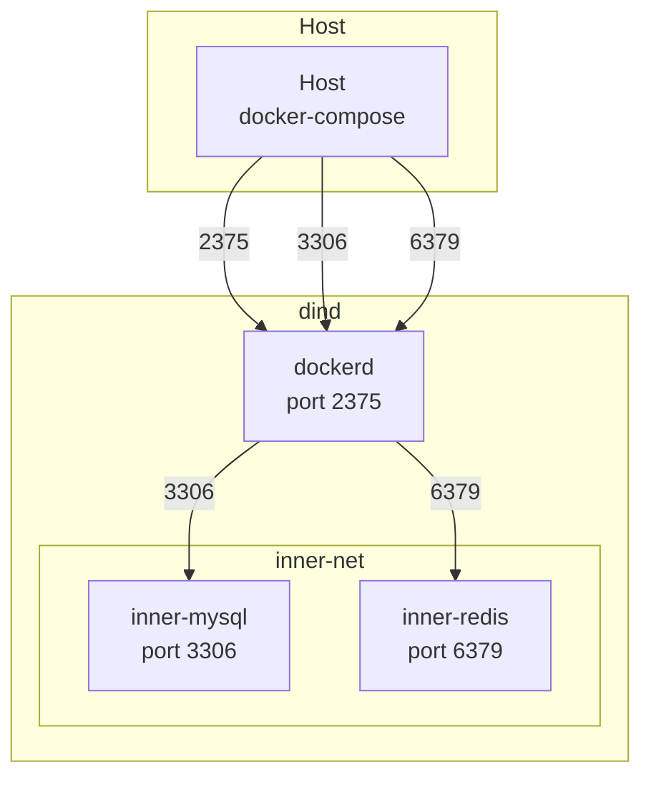

# dind sample

## Get started
```bash
docker compose up --build -d
```

```bash
docker compose exec dind docker ps
```
```bash
CONTAINER ID   IMAGE       COMMAND                  CREATED          STATUS          PORTS                               NAMES
fe4033d5891b   redis:7     "docker-entrypoint.s…"   43 seconds ago   Up 42 seconds   0.0.0.0:6379->6379/tcp              inner-redis
83a8df5acd0c   mysql:8.0   "docker-entrypoint.s…"   54 seconds ago   Up 51 seconds   0.0.0.0:3306->3306/tcp, 33060/tcp   inner-mysq
```



### ホストからMySQLにアクセス
```bash
mysql -h 127.0.0.1 -P 3306 -u demo_user -pdemopass demo
```

### dindからMySQLにアクセス
#### 
```bash
docker compose exec dind docker exec -it inner-mysql mysql -h 127.0.0.1 -P 3306 -uroot -psecretpass
```

### redisからMySQLにアクセス
```bash
docker compose exec dind docker exec -it inner-redis sh
```
```bash
apt-get update && apt-get install -y default-mysql-client
```
```bash
mysql -h inner-mysql -P 3306 -u demo_user -pdemopass demo
```

> [!note]
> 内包しているコンテナ間を接続したい場合はユーザー定義のネットワークを使うことが最良。
> ネットワークを引いていない場合、inner-mysql が名前解決できず、localhost もつながらない。→dind 内で起動した 2 つのコンテナが Docker の既定 bridge ネットワークに乗っている。
